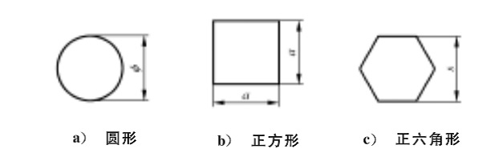

# 高精度棒线公司学习计划
## 熔炼车间 
### 了解熔炼设备、产能、过程，原料分类
#### GB 21652-2017：铜合金线材
新旧状态对比   
<table>
    <tr>
        <td>状态</td>
		<td>GB 4413-2007</td>
		<td>GB 21652-2017</td>
    </tr>
    <tr>
        <td>软态</td>
		<td>M</td>
		<td>O60</td>
    </tr>
    <tr>
        <td>1/8硬态</td>
		<td>Y8</td>
		<td>H00</td>
    </tr>
    <tr>
        <td>1/4硬态</td>
		<td>Y4</td>
		<td>H01</td>
    </tr>
    <tr>
        <td>1/2硬态</td>
		<td>Y2</td>
		<td>H02</td>
    </tr>
    <tr>
        <td>3/4硬态</td>
		<td></td>
		<td>H03</td>
    </tr>
    <tr>
        <td>硬态</td>
		<td>Y</td>
		<td>H04</td>
    </tr>
    <tr>
        <td>特硬态</td>
		<td>T</td>
		<td>H06</td>
    </tr>	
</table>
如下图所示：为圆形测直径，正方形测宽，正六边形测边距s。

  

#### 各元素的一系列属性  
<table>
    <tr>
        <td>元素</td>
		<td>原子序数</td>
		<td>熔点/℃</td>
        <td>熔点/℃</td>
		<td>密度g/cm3</td>
		<td>相对原子质量</td>
        <td>其他特性</td>
    </tr>
    <tr>
        <td>铜Cu</td>
		<td>29</td>
		<td>1083.4</td>
        <td>2562</td>
		<td>8.96</td>
		<td>63.5</td>
        <td>单质：红棕色</td>
    </tr>
    <tr>
        <td>锌Zn</td>
		<td>30</td>
		<td>419.53</td>
        <td>907</td>
		<td>7.14</td>
		<td>65.4</td>
        <td>银白色略带淡蓝、抗磁性、100-150℃变软，>200℃变脆、常温下活泼，生成薄密碱式碳酸锌膜，防止进一步氧化、氧气中燃烧发出强烈白光，焰色反应：发出蓝绿色火焰，因为锌表面有一层氧化锌，燃烧时冒出白烟，白色烟雾的主要成分是氧化锌，不仅阻隔锌燃烧，会折射焰色形成惨白光芒，所以实验室燃烧锌块没有蓝绿色火焰</td>
    </tr>
    <tr>
        <td>铅Pb</td>
		<td>82</td>
		<td>327.502</td>
        <td>1749</td>
		<td>11.3437</td>
		<td>207.2</td>
        <td>原子量最大的非放射性元素、铅原本的颜色为青白色，在空气中表面很快被一层暗灰色的氧化物覆盖、带蓝色的银白色、金属铅在空气中受到氧、水和二氧化碳作用，其表面会很快氧化生成保护薄膜；在加热下，铅能很快与氧、硫、卤素化合；铅与冷盐酸、冷硫酸几乎不起作用，能与热或浓盐酸、硫酸反应；铅与稀硝酸反应，但与浓硝酸不反应；铅能缓慢溶于强碱性溶液</td>
    </tr>
    <tr>
        <td>铁Fe</td>
		<td>26</td>
		<td>1538</td>
        <td>2750</td>
		<td>7.1</td>
		<td>55.85</td>
        <td>纯铁是白色或者银白色的，有金属光泽；能溶于强酸和中强酸，不溶于水；纯净的生铁是银白色的，铁元素被称之为“黑色金属”是因为铁表面常常覆盖着一层主要成分为黑色四氧化三铁的保护膜（黑色金属：铬、锰、铁）；磁性材料</td>
    </tr>
    <tr>
        <td>铝Al</td>
		<td>13</td>
		<td>660</td>
        <td>2327</td>
		<td>2.7</td>
		<td>27</td>
        <td></td>
    </tr>
    <tr>
        <td>镉Cd</td>
		<td></td>
		<td>320.9</td>
        <td>765.0</td>
		<td>8.65</td>
		<td>112.41</td>
        <td></td>
    </tr>
    <tr>
        <td>锡Sn</td>
		<td>50</td>
		<td>231.89</td>
        <td>2260</td>
		<td>16.3</td>
		<td>118.7</td>
        <td>常温下稳定，怕冷，怕热</td>
    </tr>
    <tr>
        <td>镍</td>
		<td>28</td>
		<td>1453.0</td>
        <td>2732.0</td>
		<td></td>
		<td>58.7</td>
        <td>具磁性、银白色，在空气中稳定不氧化、溶于硝酸、Fe-Ni记忆合金</td>
    </tr>
    <tr>
        <td>硅Si</td>
		<td>14</td>
		<td>1414</td>
        <td>2355</td>
		<td>2.33</td>
		<td>28</td>
        <td></td>
    </tr>
    <tr>
        <td>锰Mn</td>
		<td>25</td>
		<td>1244.3</td>
        <td>1962</td>
		<td>7.2</td>
		<td>54.94</td>
        <td>单质：红棕色</td>
    </tr>
</table>

#### 青铜熔炼车间
1. 熔化炉容量：  
 600kg，属于无铁芯中频感应炉；保温炉：3t  
2. 生产产品牌号：  
QSn6.5-0.1（无铅青铜，锡磷青铜）  
&emsp;&emsp;原料：回料（QSn6.5-0.1）70% + 1#紫铜（新料）（镀锡光亮线、光亮线、铜沫）+ 余料  
&emsp;&emsp;规格：直径（成盘线--12、18、21、22.5,直棒--26、28、34、40、50、55）  
C54400（有铅青铜，褐色产品卡）   
&emsp;&emsp;原料：回料/角料50% + 电解板50% （新料）   
&emsp;&emsp;生产规格：12、15.5  
3. 温度：  
熔化炉：1200-1300℃ 保温炉：1250-1300℃    
测温工具：快速热电偶  
熔炼开始：用引杆牵引  
炉渣：用料较好，炉渣较少  
保温炉：保温炉上覆盖干燥的鳞片石墨----起保温、防氧化作用  
产能：4t/24h，一天4-5炉。
4. 模具  
通冷却水，用陶瓷纤维毡来保护模具。  
5. 牵引速度  
300-500r/min  
直径毛坯：公差（直径）：+-0.5mm  
长度：4.15-4.2m
#### 特殊黄铜车间  
1. 熔炼班次  
&emsp;&emsp;一天（24h）两班，每班大约3炉  
2. 熔炼设备   
&emsp;&emsp;1号炉：容量8t左右，进料50t，产量一天45t左右，主要生产铅黄铜，铸锭直径245mm。  
&emsp;&emsp;2号炉：炉子比1#炉稍小，产量一天44t左右，生产铅黄铜。  
&emsp;&emsp;3号炉：最大的炉子，容量有9t左右，生产铅黄铜，暂时在修。  
&emsp;&emsp;4号炉：容量5t，产量20t（24h），生产铋黄铜（HPb63-0.1，PB含量0.07-0.09）。  
&emsp;&emsp;5号炉：容量2-3t，产量15t（24h），生产空心铜棒（接单生产，内径5-6mm）。  
&emsp;&emsp;保温炉：约15t左右，有2t左右余量。  
&emsp;&emsp;铸锭规格：145mm（用于1250t反向挤压机2台）和245mm（用于3150t反向挤压机），由于将上线2200t挤压机，故未来将生产165mm直径的铸锭。    
3. 原料  
&emsp;&emsp;回料：挤压、拉拔、切割等机加工过程产生的回料（分本工厂车间回料和销售后客户回来的料如（c3604））、次品、铜沫、以及检验科送来的角料（H62、H65、H68、H70等）。  
&emsp;&emsp;紫铜：电解板、光亮线（区分办法：光亮线一般是电缆线，光亮程度较好，而一号线比较复杂，会包括一些管、棒以及粗一点的漆包线，比较杂）、漆包线、1号铜、2号铜（根据氧化，氧化后呈浅绿色，和灰尘多少，含有Pb、Al、Fe、漆等杂质）（大多为线产品）。  
&emsp;&emsp;复杂黄铜回料：cw713。  
&emsp;&emsp;Zn块，Pb块，Bi块，Sn块。  
4. 其他知识  
&emsp;&emsp;回烟收集装置。炉子为水平连铸，用的是有芯工频炉（50Hz，又叫低频炉），熔化炉下面内置3个铁芯，保温炉下内置1个铁芯。（感应电炉：根据有芯无芯分2种，根据电流频率分3种，低频、中频、高频）  
&emsp;&emsp;熔化炉温度：1030-1090摄氏度，保温炉温度：  
&emsp;&emsp;抽样检测:炉水倒入模具-->冷却后倒出再用锤子进行锻打-->用抛光机进行抛光-->送检（送检编号：水平连铸炉---熔化炉：+-+-R+其中第一个+代表炉号，第二个+代表第几炉，第三个+代表第几次取样，如2-2-R1；水平连铸炉---保温炉：+-+-B+：类似熔化炉。）   
&emsp;&emsp;检测成分：Cu、Zn、PB、Fe、Al、Cd、Sn、Ni、Si、Mn、P、Bi、S、Sb、As、Cr    
&emsp;&emsp;一#紫铜料：电解板、光亮线、烧线、马达线、好铜米、1#管线等；二#紫铜料：水洗紫铜、差铜米、2#管线等。  
#### 上引熔炼车间
1. 保温炉温度  
H62、H63为1030-1050℃；H65为1035-1055℃；热电偶实时观测
2. 进出水温差  
5-12℃（水温表实时观测）
3. 冷却水压    
0.22-0.50Mpa（水压表实时观测）
4. 上引速度  
1.5-2.5m/min（仪表实时观测）
5. 节距  
2.5-5.0mm
6. 上引炉产量   
1#: 15t    
2#: 13t  2*8=16  
3#: 11t  2*9=18  
4#: 在建  2*12=24
7. 上引线径  
8.5mm、10.5mm、12mm、16mm。
### 了解目前生产牌号的国家标准以及大致的成分范围
### 通过学习了解和总结熔炼操作关键点
## 挤压车间
1. 了解目前3台挤压机的产能，可以生产的最大最小规格
2. 学习和了解挤压过程的关键控制点，了解正向和反向挤压机的工作原理和优缺点
3. 了解各牌号的挤压温度
## 直拉车间
1. 了解延伸、扒皮模具
2. 了解各规格的可控公差范围
3. 了解直拉工序的主要质量缺陷和产生原因
## 拉丝车间
1. 拉丝、拉拔、退火设备的产能和工作原理
2. 了解酸洗过程以及酸洗的配比
3. 了解拉丝车间的主要质量缺陷和产生原因
## 普黄铜车间
1. 了解上引炉产能、设备工作原理以及操作关键点
2. 了解圆线、扁线、切割母线的生产工艺
3. 了解本车间主要产品缺陷及产生原因
